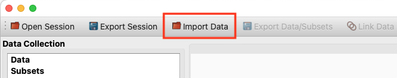
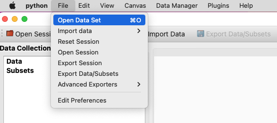
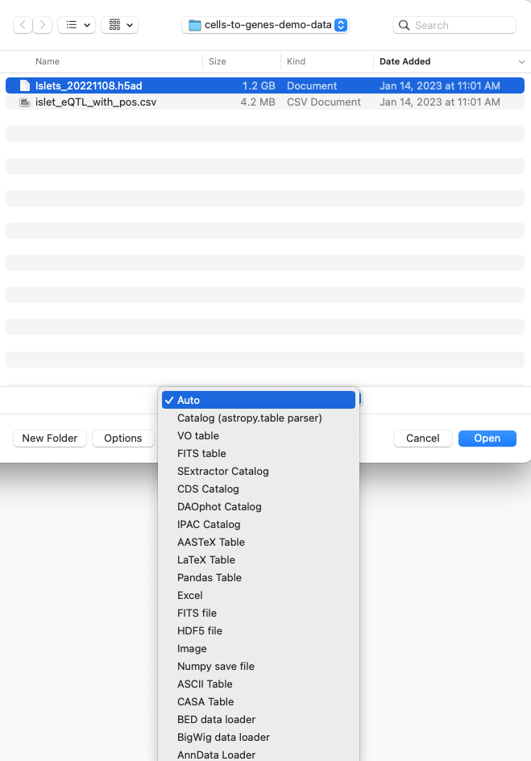
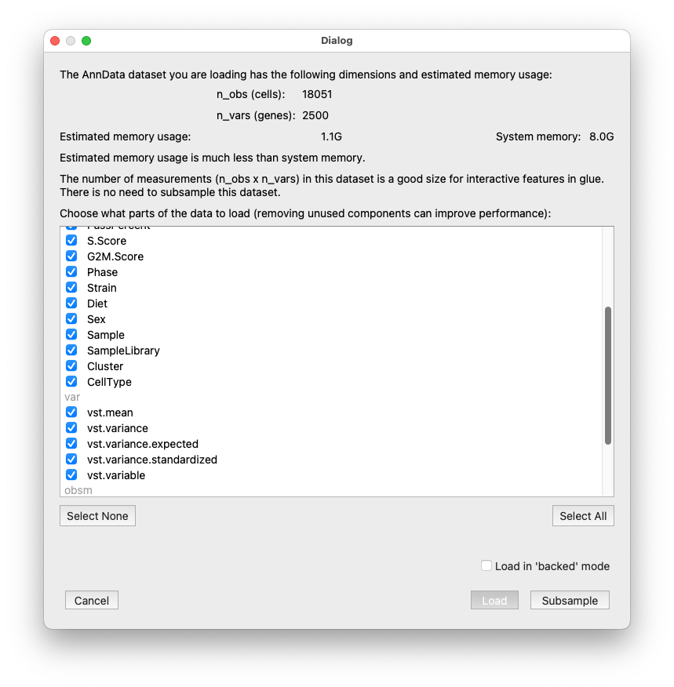

.. _Get Data In:

How do I get my data into glue genes? 
#######################################

This guide shows you how to load your genomics or transcriptomics
data into glue genes.

There are multiple ways to get data into glue genes. You can:

1. Click on the **Import Data** icon in the glue toolbar.

   Open a data set from the toolbar icon

2. Select the **Open Data Set** under the **File** menu or use the keyboard shortcut (**Ctrl+O on Linux, Cmd+O on Mac**).

   Open a data set from the menubar

3. Drag and drop files onto the main glue window.

Most of the time, glue genes will correctly identify the type of file you are loading. If it does not, you can choose a specific file type/data loader from the drop-down menu in the loading dialog:

   Choose a specific data loader if necessary.

Options for loading single-cell data
**************************************

The AnnData Loader to read in AnnData-type data (.h5ad or .loom single-cell datasets) presents an extra dialog
to allow you to configure how these datasets are loaded. This dialog will also warn you if the dataset you
are loading is too large to be loaded into memory (in which case you can load in `backed mode` to keep the
data on disk) and/or if the data has too many rows/columns for fast interactive display when
using some of the single cell menubar plug-ins (in which case the dialog presents some options for how
to handle this).

   Options for loading single-cell data.

What next?
************

After loading your data into glue genes you probably want to
:ref:`link it to other data<Link Data>` or visualize it. 