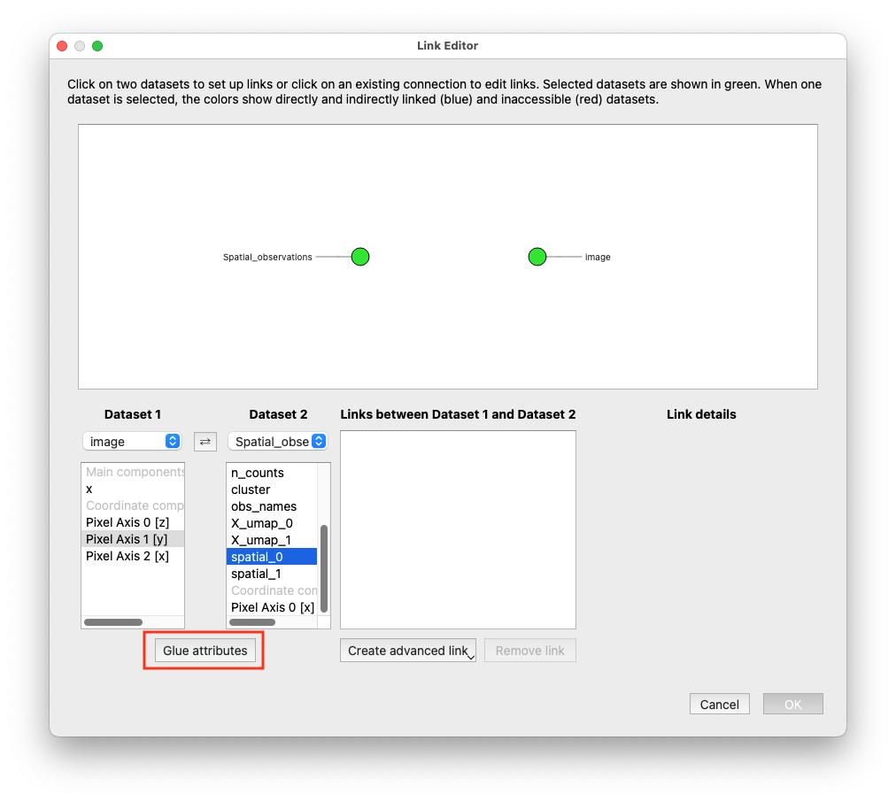
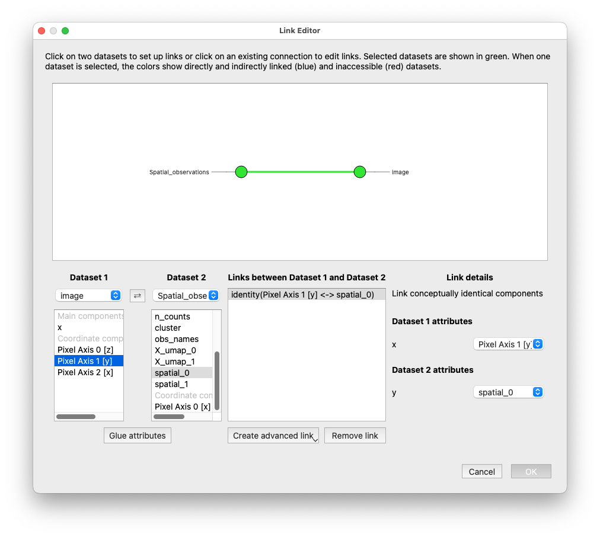
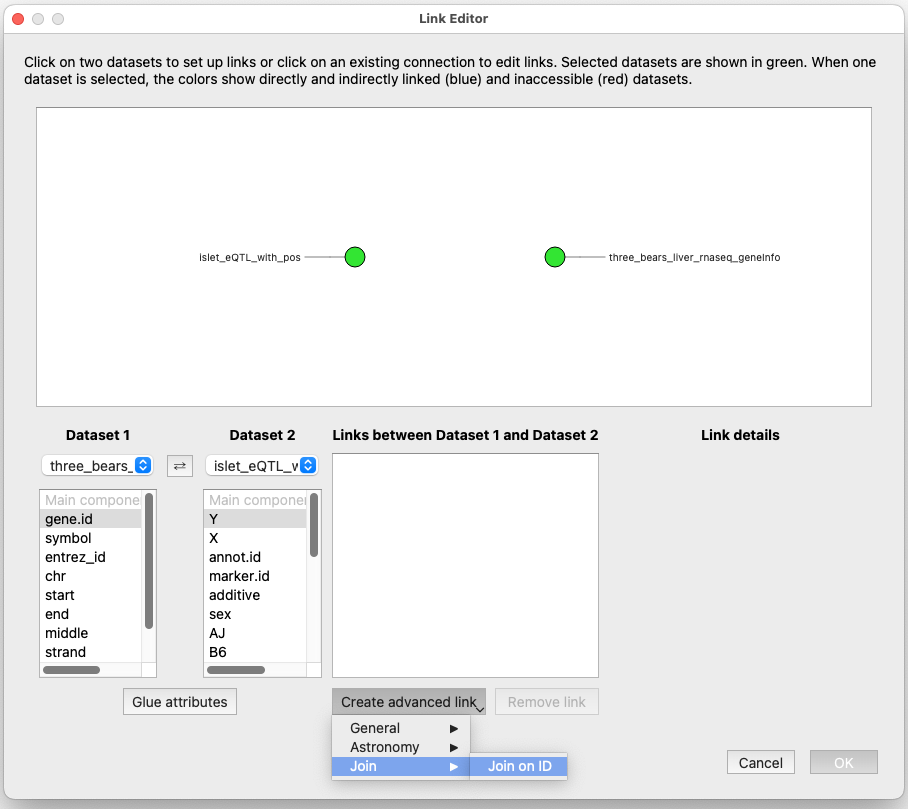
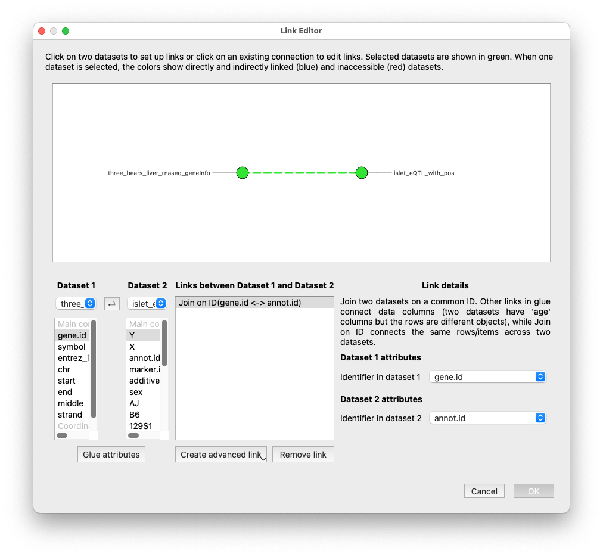

.. _Link Data:

How do I link my data in glue genes?
####################################

This guide shows you how to link together multiple datasets in glue
genes so that they may be plotted simultaneously on the same viewers
and so that subsets defined on one dataset will propagate to the
other. In general, if you have multiple datasets in glue genes you
will want to link them together to unlock the exploratory power of
glue.

Open the Link Editor
**********************

Use either the **Link Data** icon in the glue toolbar or the
**Link Data** menu option in the **Data Manager** menu to open up
the Link Editor -- the interface in which you can define links 
between datasets.

If your datasets have the same attributes...
*********************************************

If more than one of your datasets describe the same attributes or
quantities, then you can tell glue that these mean the same thing.
For instance, if you have two different datasets with experiments that 
both contain the weight of mice, you can set up an **Identity Link** 
between these two components, and now if you select a range of weights
on, for example, a histogram, that will define a subset on both datasets.

You might also have an image and a table of information about locations
in the image. By defining the links between these pixel locations, you
can both over-plot the information on the image and have selections on
the image define subsets on the table. 

In the following example, one dataset is an image and the other dataset
is a table of information obtained at a particular location (encoded 
in pixel coordinates). This is an **Identity Link**, the simplest kind
of link between attributes.

Do the following steps:

1. Identify the names of the columns/components/attributes that contain
the pixel locations. If you don't know this already, create a Table
Viewer to look at your data inside glue.

2. Select the two datasets you wish to join either by clicking on them in the central 
widget shows all the data sets as circles, or by selecting them in the drop downs
at the left side of the Link Editor (choosing Dataset 1 and Dataset 2). Note
that two datasets will be selected by default, so if you only have two datasets
they will already be selected.

3. Choose the components to link on. In this case, we choose *Pixel Axis 1 [y]* and
*spatial_0* which encode the y pixel locations in the table data. When the correct
components are selected, press the **Glue attributes** button.

   Define a link between attributes by selecting them and using the **Glue attributes** button.

The details of the link will now show on the right-hand panel, and a solid line
will show the link between the two datasets in the main display showing links between
all datasets.

   The details of the link you just set up are now shown.

4. If there are other attributes to join, you can do so now. In this case, we
we would also need to join the *Pixel Axis 2 [x]* and *spatial_1* attributes so
that the table of information can be shown on top of the image.

If your datasets describe the same items...
*********************************************

If more than one of your datasets describe the same items, such as the 
same genes or the same experimental IDs, then you can use the 
Link Editor to join these datasets on ID. This kind of join means
that any selection of points in one dataset will select points
with the same IDs in the other dataset. 

In the following example, the two datasets both contain information about
genes identified by their Mouse ENSEMBL Gene IDs. These are stored in the
data files as columns with different names. 

Do the following steps:

1. Identify the names of the columns/components/attributes that contain the two IDs. If
you don't know this already, create a Table Viewer to look at your data 
inside glue.

2. Select the two datasets you wish to join either by clicking on them in the central 
widget shows all the data sets as circles, or by selecting them in the drop downs
at the left side of the Link Editor (choosing Dataset 1 and Dataset 2).

3. Choose **Create advanced link** from the central part of the Link Editor,
and then **Join** and **Join on ID**.

   Use **Create advanced link > Join > Join on ID** to choose this kind of link.

4. The right-hand panel (*Link details*) will now populate with all the attributes 
for each dataset selected. Choose the two columns that encode the ID that is common
between the two datasets.

   Select the columns to join on under *Link details*.

5. The datasets will now be shown as connected with a dotted line. Click OK to exit
the Link Editor.

More information
*****************
See the section on `How Data Linking Works <http://docs.glueviz.org/en/stable/gui_guide/link_tutorial.html#>`_
in the glue documentation and
`the linking framework <http://docs.glueviz.org/en/stable/developer_guide/linking.html>`_
in the glue developer guide for more information about how glue handles links. 

What next?
************

Now that you have linked your data you probably want to
:ref:`visualize it<Visualize Data>`.