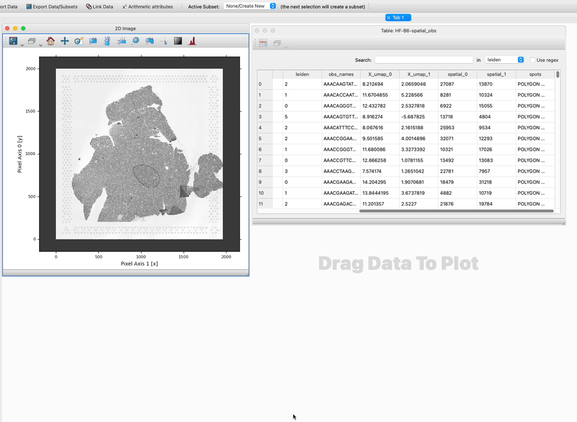

.. _Linking Observations and Images:

How do I link a table of observations and images?
##################################################

This guide shows you how to link a table of observations of any quantity
with an image of the region where those observations were made. This is
a specific case of linking datasets, which is explained in general in
the :ref:`Link Data` guide. By defining these links you will be able
to over-plot information about observations on the image and have 
selections on the image define subsets on the table and vice-versa.

Confirm your data has coordinates
**********************************

In order to link your table of observations to an image, the table must contain
two columns describing the location of the observations in an image, perhaps with
a scaling factor or shift/offset.

If your table also contain a set of polygons describing the region of the 
image covered by the observation, glue will display these regions as polygons
on the image. Otherwise, glue will plot the observations as points.

Define transforms between coordinates (if necessary)
****************************************************

If the pixel coordinates in your table are the same as the pixel coordinates
in your image, you can follow the steps in :ref:`Link Data` under the 
**If your datasets have the same attributes...** to link the two datasets.

If the pixel coordinates in your table are not the same as the pixel coordinates
in the image you wish to link to, you will need to define a transform between
the two coordinate systems, which requires a bit of python code.

The core glue documentation explains how to set up 
`Custom Link Functions <http://docs.glueviz.org/en/stable/customizing_guide/customization.html#custom-link-functions>`_
but glue genes also provide a utility function to easily set our coordinate
transforms that can be expressed as just shifts and scalings. To define these
transformations you should:

1. Create (or edit) a config.py file in your current working directory. (See
`Configuring glue via a startup file <http://docs.glueviz.org/en/stable/customizing_guide/configuration.html#configuring-glue-via-a-startup-file>`_
for additional options.)

2. Define a tranforms by adding something like the following lines to the config.py file:

.. code-block:: python

   from glue.config import link_helper
   from glue_genes.glue_genomics_data.image_link_functions import BaseLinearScaleLink

   @link_helper(category='Images')
   class Fullres_to_Hires(BaseLinearScaleLink):
      description = 'Link Fullres data to HiRes data'
      labels1 = ['FullRes']
      labels2 = ['HiRes']
      display = "Fullres <-> HiRes"
      scale = 0.053972367
      shift = 0

This example convert pixel coordinates in the Fullres image to pixel coordinates in the
HiRes image, using a scaling factor derived from the metadata in the Space Ranger output folder.
This utility function sets up a bi-directional link between the two datasets. 

Use the Link Editor to define links
************************************

Do the following steps:

1. Identify the names of the columns/components/attributes that contain
the pixel locations. If you don't know this already, create a Table
Viewer to look at your data inside glue.

2. Use either the **Link Data** icon in the glue toolbar or the
**Link Data** menu option in the **Data Manager** menu to open up
the Link Editor -- the interface in which you can define links 
between datasets.

3. Select the two datasets you wish to join either by clicking on them in the central 
widget shows all the data sets as circles, or by selecting them in the drop downs
at the left side of the Link Editor (choosing Dataset 1 and Dataset 2). Note
that two datasets will be selected by default, so if you only have two datasets
they will already be selected.

4. Choose the components to link on. In this case, we choose *Pixel Axis 1 [x]* and
*spatial_0* which encode the y pixel locations in the table data. When the correct
components are selected, select the custom function you defined in the preceeding
section of this how-to guide.

The details of the link will now show on the right-hand panel, and a solid line
will show the link between the two datasets in the main display showing links between
all datasets.

4. We have now joined the Y pixel coordinates. To complete this task we also need
we would also need to join the *Pixel Axis 0 [y]* and *spatial_1* attributes using
our custom link function so that the table of information can be shown on top of the image.

More information
*****************
See the section on `How Data Linking Works <http://docs.glueviz.org/en/stable/gui_guide/link_tutorial.html#>`_
in the glue documentation and
`the linking framework <http://docs.glueviz.org/en/stable/developer_guide/linking.html>`_
in the glue developer guide for more information about how glue handles links. The more general
case of linking arbitrary datasets is also covered in the :ref:`Link Data` guide.

What next?
************

Now that you have linked your data you probably want to
:ref:`visualize it<Visualize Data>`.