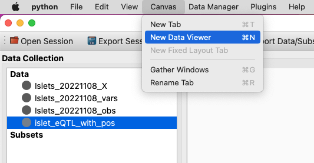
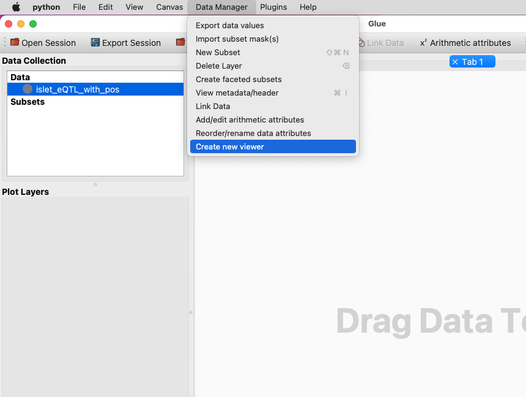

.. _Visualize Data:

How do I visualize my data?
###########################

This guide shows you how to visualize your data in glue genes,
using either the core glue viewers or the additional viewers
added by glue genes. 

There are multiple ways to create a Viewer and visualize a dataset
in glue genes. You can:

1. Drag and drop a dataset (or subset) into the main viewer area. A pop-up menu will allow you to select the kind of viewer you want to make. The dataset you dragged in will be visualized in the Viewer.

.. figure:: images/drag_to_create.*
   :align: center
   :width: 100%

   Drag and drop a dataset to create a new Viewer.

2. Select the **New Data Viewer** under the **Canvas** menu or use the keyboard shortcut (**Ctrl+N on Linux, Cmd+N on Mac**). A pop-up menu will allow you to select the kind of viewer you want to make. Note that this will create an empty Viewer with no data in it. You will have to add data to dragging-and-dropping a dataset from the Data Collection into the Viewer window.

   Create a new Viewer from the **Canvas** menu

3. Select/highlight a dataset in Data Collection Area. Then select **Create new viewer** from the **Data Manager** menu. A pop-up menu will allow you to select the kind of viewer you want to make and the dataset you have selected will be visualized in the Viewer.

   Create a new Viewer from the **Data Manager** menu

What next?
**********

Now that's you've made one or more visualization you may want
to :ref:`bring in more data<Get Data In>` and :ref:`link it to existing datasets<Link Data>` or you might want to explore interesting subsets of the data.