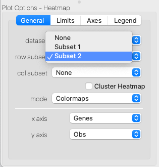

.. _Visualize Expression Matrix:

How do I visualize an expression matrix?
########################################

This guide shows you how to visualize your expression matrix using the Heatmap Viewer bundled with glue genes. An expression matrix is a 2D array of values showing the value of variable (e.g. gene expression) for each observation (e.g. cell or spatial patch).

Load the Data
*************
Use one of the various methods to :ref:`bring in data<Get Data In>`. Expression matrices might be in an AnnData file or included as part of a Spatial Transcriptomics dataset. Using one of these data loaders will create several datasets in the Data Collection Area of glue. The expression matrix will typically be denoted by the suffix ``_X``.

Create a Heatmap Viewer
***********************

To create a Heatmap Viewer, select the expression matrix dataset in the Data Collection Area and then create a Heatmap Viewer using one of the methods in :ref:`visualizing data<Visualize Data>` -- the simplest is just to drag-and-drop the dataset onto the main glue window and select the Heatmap Viewer from the list of available viewers.

Configure the Viewer
*************************

The Heatmap Viewer acts much like an Image Viewer, and can be configured to change the colormap, contrast and bias of the underlying dataset to focus on different parts of the data. Often, the full expression matrix will be very large, and so it will be useful to apply subsets over observations or variables to focus on a particular part of the data. This can be done by assigning row subsets or column subsets in the Plot Options portion of the interface. Any subset that defines a selection over observations or variables can be used here.

   Selecting a subset over rows or columns of the expression matrix.

Clustering and Selecting
*************************

The Heatmap Viewer also allows you to apply hierarchical clustering to the rows and columns of the expression matrix. This can be done by checking the ``Cluster`` checkbox in Plot Options. The clustering will be applied to the current subset of the data. You can then use the normal selection tools to define interesting subsets of observations or variables seen in the clustered heatmap, and these clusters will propogate to all other linked datasets.

