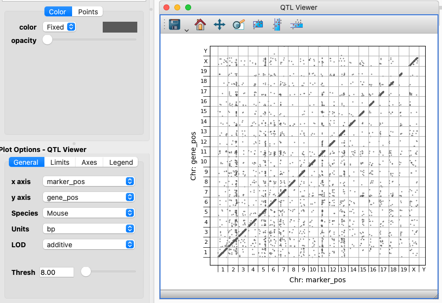
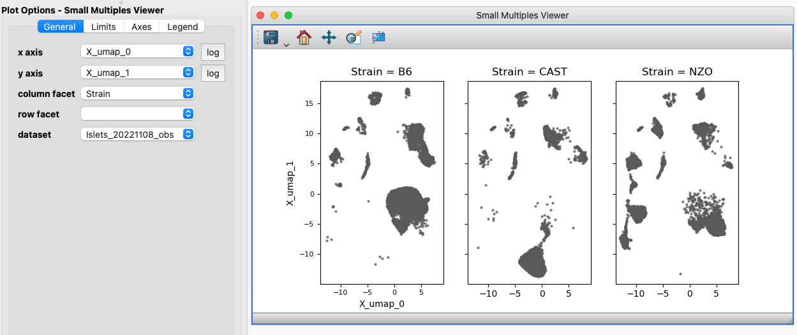

.. _User Guide:

glue genes User Guide
######################

This User Guide explains the core features of glue genes. For more details on how core glue works, see the `core glue documentation <http://docs.glueviz.org>`_. Please note that this User Guide is a work-in-progress.

New Data Loaders
*****************

Single-Cell Data
=================

glue genes supports loading single-cell type data via the `AnnData package <anndata.readthedocs.io>`_. Since glue requires that all data objects should have components of equal dimension, the AnnData data loader parses the underlying AnnData object into linked glue data objects as shown below:

   
      How the pieces of AnnData object map onto glue data objects

Generally, the 2D X matrix is not used directly, but is used to connect the gene (var) and cell (obs) 1D data tables through the use of analysis plug-ins.

.. note::
   If glue is started without the ``--startup=setup_anndata`` flag, then the Link Editor will not show the links between the _var, _obs, and _X data sets. These links will still be present, however.

BED and BigWig Data
====================

glue genes uses the `pyranges <https://pyranges.readthedocs.io/en/latest/>`_ package to support loading BED and BigWig data files. Because the BED file format is quite flexible but lacks metadata, glue genes does not attempt to guess names for most of the components. The first three components get the predefined names, and subsequent components are left for the user to rename.

New Viewers
************

QTL Viewer
===========

The QTL (quantitative trait locus) Viewer is a customized version of the 2D Scatter Viewer with two main additional features: chromosome markings and LOD score filtering. The Viewer is specifically designed to work with datasets obtained from the `Churchill Lab QTL Viewer <https://churchilllab.jax.org>`_, but will generally work with any QTL dataset that contains gene and marker positions that are monotonically increasing (i.e. describing a position along the full genome rather than just within a chromosome).

   
      The QTL Viewer and options

The QTL Viewer is designed for the monotonically increasing marker and gene positions to be plotted on the X and Y axis. In this setup a **Species** can be selected to show the chromosome divisions. If your data describes positions in a different unit that can be configured. 

If your dataset contains one or more LOD (logarithm of the odds) scores, then you can select the appropriate component and filter using the **Thresh** slider or input field to limit display to associations with higher significance. Selections/subsets defined using this viewer will also include the Threshold value. That is, if you filter the data to only show more highly significant associations then a subset with that filter in place will only include the points you actually see. 

Heatmap Viewer
===============

The Heatmap Viewer is an extra Viewer bundled by default with glue genes for the display and analysis of matrix-type data. The 2D Image viewer can also display matrix-type data, but the Heatmap Viewer displays labels for the elements of the matrix and provides subset definitions that are tailored for the kinds of categorical data shown in a heatmap.

Small Multiples Viewer
=======================

The Small Multiples Viewer is an extra Viewer bundled by default with glue genes for the display of 2D scatter plots faceted by categorical variables. For instance, in the single cell context you might display properties of cells in a 2D scatter plot faceted by one or more experimental factor. A Small Multiples chart is sometimes referred to as a Facet plot of a Trellis plot.

   
      The Small Multiples Viewer and options. Here we are just faceting out the columns based on a categorical component, but it is also possible to facet on a second component and get a grid of small multiples. 

.. note::
   Selections/subsets made on a Small Multiples Viewer will be the combination of the area selected and the value of the categorical component displayed in that small multiple. The combination of a 2D Scatter Viewer showing all the data and a Small Multiples Viewer provides for an excellent "compared to what?" context for subsets.

Analysis Plug-ins
******************

The analysis plug-ins bundled with glue genes can be broken down into two categories: those designed for single cell analysis and those that are more generally applicable.

General Plug-ins
==================

Enrich Gene Set via Enrichr
----------------------------

This plug-in uses the `enrichrpy library <https://github.com/estorrs/enrichrpy>`_ to query the `Enrichr <https://maayanlab.cloud/Enrichr/>`_ API for `Gene Set Enrichment Analysis <https://pubmed.ncbi.nlm.nih.gov/16199517/>`_. Currently this plug-in supports retrieving KEGG pathways for a particular set of genes and returns a full glue data object with the results of the query which is automatically joined-on-key to the dataset where the gene subset was drawn for. 

   
      The interface for the Enrichr plugin.

Single Cell Analysis Plug-ins
===============================

Scanpy Differential Gene Expression
------------------------------------

A basic guide to using this plug-in is :ref:`here<DGE Between Cell Subsets>`

Calculate Summary Over Gene Subset
------------------------------------
A basic guide to using this plug-in is :ref:`here<Gene Expression Summary>`

 